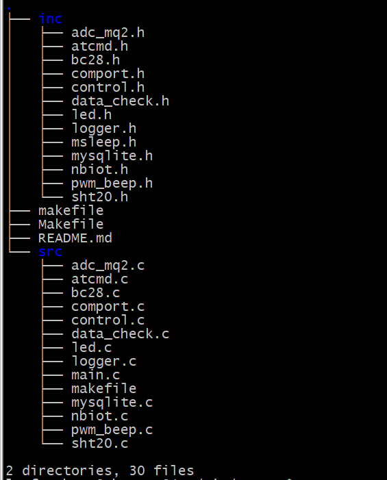

# NB-IoT smoke alarm

### 介绍

本项目为基于NB-IoT的智能烟雾报警器，支持烟感报警探头、空气温度和空气湿度传感器，对采集的数据进行数据分析处理，实现一定传感器校准功能，确保在日常工作生活中不会触发报警，并通过NB-IoT通信技术定时上报数据到云服务器端，同时支持云端控制蜂鸣器和警报灯的开关，用户也能实时访问web查看数据及报警情况。

### 软件架构



### main流程图


### 安装教程

```c
/* 安装 */    
~/git/NB-Iot$ make   
/* 卸载，清除可执行文件和目标文件 */    
~/git/NB-Iot$ make distclean
```
### 使用说明

```c
/*usage :
-d(--device): specify BC28 comport device, default /dev/ttymxc7
-b[daemon]: start daemon
-t(--time_interval): set data reporting time interval, default 5s
-h(--help): print this help information.
*/
~/git/NB-Iot$ ./smoke      

```
### 参与贡献

1.  Fork 本仓库
2.  新建 main 分支
3.  提交代码
4.  新建 Pull Request
